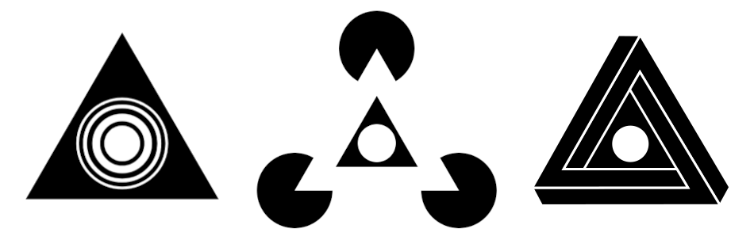
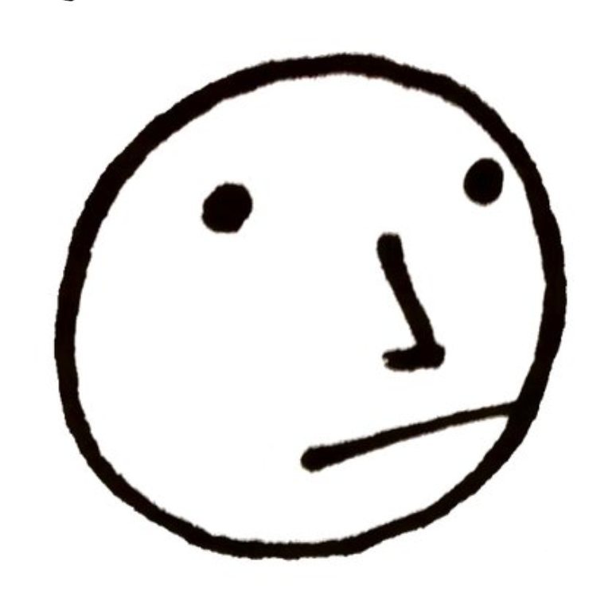

# Ibis Coordination

__Ibis Coordination__ is a one-man company founded by Dan Allison with the mission of making group coordination easy.

## Training

### Group Coordination for Business

_Launching June 2025_

The [Group Coordination for Business](/group-coordination-for-business) training course solves the obscenely expensive problem of __Too Many Meetings__ by providing business teams with a coordination framework that eliminates the need for meetings.

## Software

### `harmonic.team`

[`harmonic.team`](https://harmonic.team) (formerly `decisive.team`) is open-source software for fast group coordination.

The design of the application is based on 3 concepts:

* Awareness indicators
* Acceptance voting
* Reciprocal commitments

Read more [here](https://harmonic.team)

## Coordination Camp

[Coordination Camp](https://coordination.camp) is an event to bring together people who share a common interest in group coordination.

## About Dan Allison

Hi I'm Dan. My interest in group coordination began at an early age through music and comedy improv. In addition to my experience in the arts, my perspective on group coordination has also been influenced by the work of researchers like Elinor Ostrom (commons governance), Edwin Hutchins (distributed cognition), and Michael Levin (collective intelligence).

You can read more about my background [here](/about-dan).

## Contact

Contact [Dan Allison](https://danallison.info) via email at [dan.allison@protonmail.com](mailto:dan.allison@protonmail.com)
