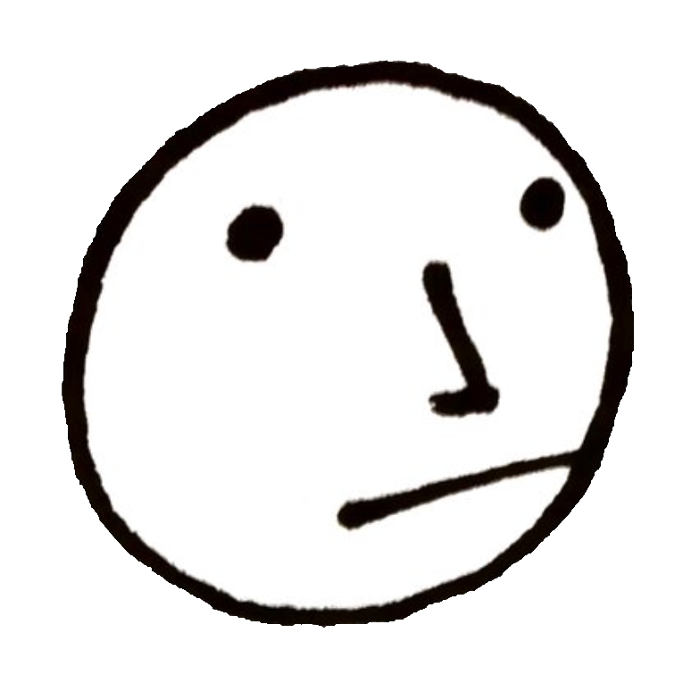

# Ibis Coordination

__Ibis Coordination__ is a one-man company founded by Dan Allison with the mission of making group coordination easy.

## Software

### `harmonic.team`

[`harmonic.team`](https://harmonic.team) (formerly `decisive.team`) is open-source software for fast group coordination.

The design of the application is based on 3 concepts:

* Awareness indicators
* Acceptance voting
* Reciprocal commitments

Read more [here](https://harmonic.team)

## Coordination Camp

[Coordination Camp](https://coordination.camp) is an event to bring together people who share a common interest in group coordination.

## About Dan Allison

Hi I'm Dan. My interest in group coordination began at an early age through music and later comedy improv. I started Ibis Coordination because I kept noticing how simple coordination concepts are widely misunderstood and underutilized. My goal is to make these basic concepts more obvious and easy to use.

## Contact

Contact [Dan Allison](https://danallison.info) via email at [dan@decisive.team](mailto:dan@decisive.team).
